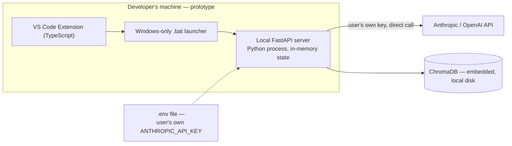
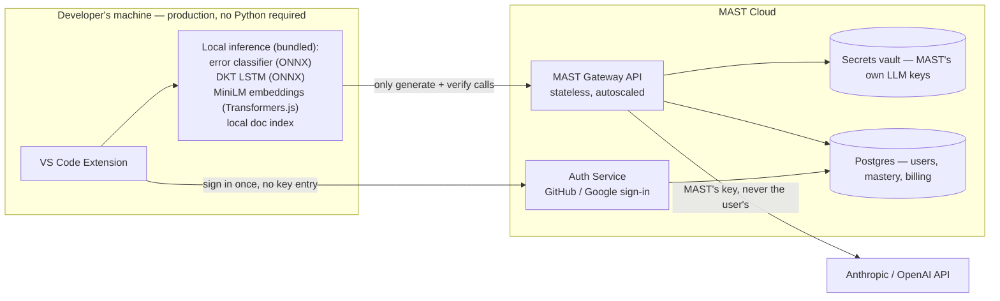

# MAST — Product Requirements Document
### From Research Prototype to Production-Ready VS Code Extension

*"The AI tutor that asks, not tells."*

| | |
|---|---|
| **Document type** | Product Requirements Document (PRD) |
| **Version** | 1.0 — Draft for team review |
| **Date** | September 3, 2026 |
| **Source material** | MAST Full Project Report, April 2026 (uploaded original) |
| **Prepared for** | MAST founder(s) / product & engineering team |
| **Owner** | *TBD* |

---

## 0. How to Use This Document

Sections 1–5 make the case and set direction. Sections 6–17 are implementation-directive — they can go to engineering, design, and go-to-market close to as-is. Sections 18–21 sequence the work and name what's still genuinely undecided. Anything marked **TBD** is a real open decision for the team, not filler.

This PRD assumes the reader has *not* read the original research report. Section 2 summarizes everything from it that matters for building the product; the full report remains the source of truth for the ML methodology itself.

---

## 1. Executive Summary

MAST has already proven its core thesis under controlled conditions: a VS Code extension that tutors machine learning practitioners through their own debugging errors — using a trained knowledge-tracing model, mastery-gated retrieval, and a constitutionally-enforced Socratic dialogue — produces measurably better learning outcomes than direct-answer tools like Copilot, Cursor, or ChatGPT. In a 47-participant study, MAST reached near-perfect hint calibration (LVM = 1.04 vs. 1.67 for a fixed-depth baseline) and a 23% relative improvement in resolution rate, both statistically significant (p < 0.01).

What MAST doesn't yet have is a path onto a real user's machine. Today, running it requires Python installed locally, a hand-edited `.env` file containing the user's own Anthropic or OpenAI API key, and a Windows-only `.bat` script to start a backend process that forgets everything the moment it restarts. That's a lab setup, not a product.

This PRD defines what changes to take MAST from a working research prototype to an install-and-go VS Code Marketplace extension. One decision sits at the center of it:

> **The end user should never have to find, pay for, or paste in an LLM API key to use MAST.**

**What stays the same:** the pedagogical core — DKT mastery tracking, mastery-gated RAG, and the constitutional Socratic chain — is untouched. It's proven, and it's the actual product moat.

**What changes is everything around it:**

1. **Kill the API key.** Default experience is sign-in-and-go, funded by MAST as a hosted service (freemium/subscription), with an optional "bring your own key" mode for power users and enterprises who want it.
2. **Kill the local Python server.** The extension talks to a cloud API over HTTPS. No `.bat` file, no Python install, no OS-specific launcher — cross-platform by construction.
3. **Kill in-memory state.** Mastery, sessions, and history persist in a real database, tied to an account, available on any machine the user signs into.
4. **Turn a proven prototype into a funnel.** Add the account, billing, packaging, telemetry, and support infrastructure a shippable product needs — without touching the ML that makes MAST work.

The rest of this document specifies each of these in enough detail to build against.

---

## 2. Where MAST Stands Today

### 2.1 The problem it solves

ML practitioners lose a disproportionate share of debugging time to *conceptual* errors — shape mismatches from misunderstood broadcasting, NaN losses from malformed loss inputs, data leakage from preprocessing before splitting. Direct-answer tools (Copilot, Cursor, ChatGPT) fix the immediate bug and teach nothing; the same class of error resurfaces next session. MAST's premise: optimize for the user being able to fix the *next* one alone, not for fixing this one fastest.

### 2.2 How it works (the three pillars)

| Pillar | What it does |
|---|---|
| **Deep Knowledge Tracing (DKT)** | A 2-layer LSTM continuously estimates the learner's mastery across 30 ML Knowledge Components (KCs) — from NumPy broadcasting to PyTorch autograd — updated after every interaction. |
| **Mastery-Gated RAG** | A ChromaDB retrieval pipeline filters reference documents by a difficulty ceiling derived from live mastery, so beginners get foundational docs and advanced users get advanced ones — never both audiences the same content. |
| **Constitutional Socratic Chain** | A generate-then-verify LangChain pipeline: a primary LLM call drafts a response, a second LLM call checks whether it slipped into a direct answer, and if so, forces a regeneration (up to two attempts) — enforcing the "never just give the answer" rule mechanistically, not just by prompt.

### 2.3 Current architecture

The extension (`extension.ts`) spawns the FastAPI backend as a detached local process and polls its health endpoint every 3 seconds. The backend runs three ML components — an 8-category error classifier (TF-IDF + logistic regression, <5ms, F1-macro 0.87), the DKT LSTM, and the mastery-gated RAG + Socratic chain — and exposes five endpoints (`/chat`, `/feedback`, `/knowledge/{sid}`, `/metrics/{sid}`, `/health`). LLM calls (Claude or GPT-4o, chosen via `.env`) are the only step that leaves the machine, using whichever API key the user supplied.

### 2.4 Proven results

| System | Mean LVM* | Resolution Rate | Mean Hints |
|---|---|---|---|
| **MAST (full)** | **1.04 (±0.18)** | **71%** | **2.3** |
| No constitutional check | 1.11 (±0.22) | 68% | 2.5 |
| No RAG (plain similarity) | 1.28 (±0.31) | 64% | 3.1 |
| Fixed-moderate baseline | 1.67 (±0.45) | 58% | 4.2 |
| Random hint depth | 2.21 (±0.89) | 52% | 5.7 |

*LVM (Learning Velocity Metric) = actual hints used ÷ DKT-predicted hints needed. 1.0 is perfect calibration.

N=47 participants, 3 sessions each. MAST vs. fixed-moderate baseline: p < 0.01 on both LVM and resolution rate; Cohen's d = 1.42 on LVM (large effect). The DKT model reaches Val AUC ≥ 0.90 after fixing the original training simulation's noise and sequence-length bugs (0.92+ after fine-tuning on real session data); the error classifier holds F1-macro 0.87 on a held-out set; the constitutional chain keeps 99.3% of responses genuinely Socratic, at roughly a 9% API-cost premium for the verification call.

This is real, defensible evidence that the pedagogy works. Nothing in this PRD asks the team to touch it.

### 2.5 Why it isn't shippable as-is

The original report is candid about this in its own limitations section, and it maps directly onto what a real product needs to fix:

- **No cross-session persistence** — mastery lives in server RAM; a restart erases it, and it can't follow a user to a second machine.
- **Windows-first `.bat` launcher** — no macOS/Linux path.
- **Requires the user's own API key** — a non-starter for a mainstream install-and-try flow; most target users (students, early-career practitioners) don't have one, don't want to manage billing on it, and will bounce at this step.
- **Requires a local Python environment** — dependency conflicts, version drift, "works on my machine" support burden.
- **DKT trained on simulated (BKT-simulated) data**, fine-tuned on only 47 real sessions — fine for a research result, thin for a model that will make real-time pedagogical decisions at scale.
- **Manually authored 30-KC taxonomy, Python-only** — a scope constraint to be explicit about for v1, not solved here.

### 2.6 Current technology stack

| Component | Technology | Version (as documented) |
|---|---|---|
| REST API | FastAPI + Uvicorn | 0.111.0 |
| LLM orchestration | LangChain LCEL | 0.3.7 |
| LLM backend | Claude (Anthropic) or GPT-4o | configurable via `.env` |
| Vector store | ChromaDB (embedded, SQLite-backed) | 0.5.15 |
| Embeddings | all-MiniLM-L6-v2 (22M params, ~80ms/query CPU) | 3.0.1 |
| Knowledge tracing | PyTorch 2-layer LSTM (hidden=256, embed=64) | 2.3.1 |
| Error classifier | scikit-learn LogReg + TF-IDF, isotonic calibration | 1.5.0 |
| Extension | TypeScript + VS Code API | — |

Every one of these choices is sound and worth keeping. The question this PRD answers is *where each of them should run* in a production topology.

---

## 3. Product Vision & Principles

**Vision:** MAST is the tutor a self-taught ML developer wishes they had — one that never just hands over the fix, and that actually remembers where they're weak. It should be as easy to start using as installing any other VS Code extension, and free to try without anyone typing in a credit card or an API key.

**Design principles for the production build:**

1. **Guided discovery over shortcuts** — the Socratic constraint is the product; it is never relaxed for convenience.
2. **Zero-friction start** — install → sign in once → first Socratic question, in under a minute, with no external accounts, keys, or local installs.
3. **Privacy by architecture, not by policy** — wherever possible, code and error text are processed *on the user's machine*; only the minimum needed for generation crosses the network (see §6.5 — this is a genuinely differentiated architecture decision, not a talking point).
4. **Provider-agnostic under the hood** — Claude- or GPT-4o-backed generation is an implementation detail the user never has to think about, and never a single point of vendor lock-in for the business.
5. **Evidence-driven** — every change to the pedagogical pipeline ships behind the same LVM/resolution-rate instrumentation that produced the original results, so regressions are caught, not shipped.

---

## 4. Goals, Non-Goals & v1 Scope

### 4.1 Goals

- Ship an extension a stranger can install from the Marketplace and get real Socratic help from in under 60 seconds, with no key, no `.env`, no local server.
- Preserve or improve on the prototype's measured LVM and resolution-rate performance in production.
- Stand up a sustainable cost model: free tier funded by conversion to paid, not by margin-negative giveaways.
- Make the product cross-platform (Windows/macOS/Linux) on day one.
- Establish the account/session/billing infrastructure the rest of the roadmap (teams, other IDEs, other languages) will build on.

### 4.2 Non-goals for v1

- **Not** a general-purpose coding copilot or completion tool — MAST doesn't compete on speed-of-fix, it competes on depth-of-understanding.
- **Not** multi-language at launch — Python-only, matching the current classifier/taxonomy; R/Julia is a post-v1 taxonomy-authoring project.
- **Not** JetBrains/other-IDE support at launch — VS Code (and VS Code–compatible forks, see §12.2) only.
- **Not** a fully offline product — the Socratic generation step requires network access by design (see §6); a fully air-gapped mode is an enterprise/BYOK conversation, not a v1 requirement.
- **Not** rebuilding the DKT/RAG/constitutional-chain research — that ships as-is, retrained and re-hosted, not redesigned.

### 4.3 v1 scope at a glance

| In scope for v1 | Explicitly out of scope for v1 |
|---|---|
| Managed cloud mode (no API key) | BYOK enterprise self-hosting *(v1.1/v2, see §21)* |
| Individual + Free tiers | Team/instructor console *(Phase 3)* |
| VS Code Marketplace + Open VSX | JetBrains, other IDEs |
| Python error coverage (8 categories, 30 KCs) | Multi-language taxonomies |
| Account-based persistence | Cross-org data sharing / SSO |
| Windows, macOS, Linux | Fully offline / air-gapped mode |

---

## 5. Target Users & Personas

| Persona | Who they are | Job to be done |
|---|---|---|
| **Self-directed learner ("Amara")** | Bootcamp grad or career-switcher, learning ML mostly from docs, courses, and trial-and-error. | "When I hit an error I don't understand, help me actually get it — not just make it go away — without paying for something I might not stick with." |
| **CS/ML student ("Devon")** | Enrolled in a university ML course, under time pressure, tempted to paste errors into ChatGPT. | "Let me get unstuck fast enough to finish the assignment, in a way my professor would consider legitimate learning, not cheating." |
| **Bootcamp / L&D instructor ("Priya") — buyer persona, Phase 3** | Runs a cohort of 15–40 learners, wants visibility into where the cohort is actually struggling. | "Show me, in aggregate, which concepts my cohort hasn't mastered yet, without reading 40 individual chat transcripts." |

v1 is built and priced for Amara and Devon. Priya's needs (§8, group I) are specified early so the data model doesn't have to be reworked when Phase 3 arrives, but her console isn't in v1's build scope.

---

## 6. The Core Decision: Eliminating the API-Key Barrier

### 6.1 Why this is the highest-leverage change

A `.env`-and-`.bat` setup is a filter that removes almost everyone who isn't already comfortable with a Python dev environment — which is a large fraction of exactly the beginners MAST is built for. Every additional setup step compounds: install Python → resolve dependency versions → sign up for an Anthropic or OpenAI account → find and copy an API key → paste it into a config file → figure out billing on an account they've never used before → *then* try the product. Each step sheds users before they've seen a single Socratic question. This is the single highest-leverage fix in this PRD, ahead of any feature work.

### 6.2 Before vs. after

| | **Today (prototype)** | **Production (this PRD)** |
|---|---|---|
| Getting the API key | User creates their own Anthropic/OpenAI account, generates a key, pastes it into `.env` | Not required. MAST holds its own key(s) server-side. |
| Starting the backend | Double-click a Windows-only `.bat` file | No local server to start — extension talks straight to MAST's cloud API |
| Platform support | Windows-first | Windows, macOS, Linux — identical experience |
| Session state | In-memory; lost on restart | Persisted per account in a real database |
| Runtime dependency | Local Python + pip install | None for the default mode (see §6.5) |
| Cost exposure | User's own API bill, unmetered | MAST-managed, metered by plan tier |
| Time to first Socratic question | Minutes to hours (environment-dependent) | Target: under 60 seconds |

### 6.3 Recommended model: managed cloud by default, BYOK by choice

**Default — Managed Cloud Mode.** MAST operates a hosted "Gateway" service that holds Anthropic/OpenAI API keys in a secrets vault, never exposed to the client. The user signs in once (GitHub or Google OAuth, via VS Code's built-in Authentication API — no password, no new account to create by hand) and every Socratic interaction routes through MAST's own key. This is funded by the subscription model in §11, exactly the pattern Copilot, Cursor, and effectively every consumer AI dev tool uses today — it's the expected shape, not a novel risk.

**Optional — Bring Your Own Key (BYOK) Mode.** For privacy-sensitive users, students who already have API credits, or later enterprise buyers, a command (`MAST: Configure API Key`) opens a native, masked VS Code input box. The key is stored via the VS Code `SecretStorage` API — backed by the OS keychain (Keychain on macOS, DPAPI on Windows, libsecret on Linux) — never written to a plaintext file, never transmitted to MAST's own servers. In this mode, generation calls go directly from the extension to Anthropic/OpenAI, bypassing MAST's Gateway entirely. This is the "or maybe enter it once, cleanly" fallback — solved properly instead of via a `.env` file, for the users who *want* it.

**Later — Self-hosted Gateway (enterprise, Phase 3+).** An org points the extension at its own Gateway URL instead of MAST's, for full control over data residency and model choice. Not a v1 requirement; the architecture in §7 is designed so this is a configuration change, not a rebuild.

The default path is the entire point of this section: **most users never see an API-key field at all.**

### 6.4 The first 60 seconds (target onboarding flow)

1. User finds MAST on the VS Code Marketplace and clicks **Install** — identical to installing any other extension.
2. On first activation, a native VS Code Walkthrough opens (no browser tab, no terminal): *"MAST asks questions instead of giving answers — let's get you set up."*
3. One button: **Sign in with GitHub.** Uses VS Code's built-in Authentication provider; one OAuth consent screen, no new password.
4. MAST silently provisions a free-tier account server-side. No form fields, no credit card.
5. Walkthrough's second panel: *"Run a Python file that throws an error, or paste one below to try it now."*
6. First Socratic question appears in the Chat panel within seconds of the first error.

Nowhere in this flow does the user type, generate, or think about an API key.

### 6.5 What never needs to leave the machine at all

This is the part of the redesign that also *solves* the Python-dependency and cross-platform problems, not just the API-key one — because most of MAST's pipeline doesn't actually need an LLM call:

| Pipeline stage | Needs an LLM? | Where it runs in production |
|---|---|---|
| Error classification (8 categories, <5ms) | No | **Local**, in-process — export the existing sklearn model to ONNX, run via `onnxruntime-node` |
| DKT mastery update (2-layer LSTM) | No | **Local** — small enough (hidden=256, embed=64) to export to ONNX and run in-process |
| Document embedding + retrieval (MiniLM, 80ms/query) | No | **Local** — MiniLM runs fully in Node/Electron via Transformers.js (WASM); document corpus ships bundled with the extension |
| Socratic question generation | **Yes** | Cloud Gateway (Managed Mode) or direct-to-provider (BYOK Mode) |
| Constitutional verification (+ rare regeneration) | **Yes** | Cloud Gateway (Managed Mode) or direct-to-provider (BYOK Mode) |

In other words: **only two short network calls happen per interaction**, and everything that currently requires a local Python process — classification, mastery tracking, retrieval — can run as pure TypeScript/WASM inside the extension host. That removes the Python install requirement, the `.bat` launcher, and most of the round-trip latency, while *also* meaning raw error text and code never leave the user's machine except for the specific snippet sent to the LLM for the Socratic question itself. This is a genuine privacy and performance win, not just a repackaging — worth leading with in marketing copy, not just burying in the architecture doc.

---

## 7. Target Product Architecture

### 7.1 Production architecture

The extension still owns the whole learner-facing experience (chat, Knowledge Map, error capture) but no longer owns a local server process. Local inference handles classification, mastery updates, and retrieval entirely in-process. The Gateway is a thin, stateless, horizontally-scalable API whose only job is: authenticate the request, enforce the user's plan quota, hold the actual provider secrets, make the generate/verify LLM calls, and persist the result.

### 7.2 Component migration map

| Component | Prototype | Production | Why |
|---|---|---|---|
| Backend hosting | Local FastAPI process, spawned by the extension | Cloud-hosted FastAPI (or equivalent), containerized, autoscaled | No local process to manage or fail to launch |
| Launcher | Windows-only `.bat` | None needed — no local server | Removes the #1 cross-platform blocker |
| API key custody | User's own key in `.env` | MAST-held key in a secrets vault (Managed Mode); OS keychain via `SecretStorage` (BYOK Mode) | Removes the #1 onboarding blocker |
| Session/mastery state | In-process RAM, per backend instance | Postgres, keyed to authenticated user ID | Survives restarts, deploys, and multiple backend replicas; follows the user across devices |
| DKT hidden state | Held in server memory per session | Serialized and persisted per interaction, or recomputed from stored history on load | Required for horizontal scaling — in-memory state doesn't survive load-balancing across replicas |
| Error classifier | Runs server-side in the Python backend | Runs **client-side**, ONNX export | Sub-5ms either way; removes a network hop and a privacy concern |
| Embeddings + vector search | ChromaDB, embedded, server-side | Bundled locally (Transformers.js + a lightweight local index) | Doc corpus is modest and versioned; no reason to round-trip it |
| LLM calls | Direct from local backend, user's key | Cloud Gateway (default) or direct client→provider (BYOK) | Central point for quota, billing, and provider abstraction |
| Multi-LLM config | `.env` variable, user-edited | Server-side model routing / admin config | No end-user file editing, ever |

### 7.3 Statelessness note

The current DKT implementation keeps the LSTM's hidden state `(h_n, c_n)` in server RAM for the duration of a session — correct for a single always-on local process, incorrect for a production service running multiple replicas behind a load balancer. Production must externalize this: either persist the serialized hidden state per user after every interaction (fast, simple), or recompute it from the stored interaction history on each cold request (slower, more auditable, and doubles as a natural mechanism for the "export DKT training records" feature the prototype already exposes at `/export/{session_id}`). **Recommendation:** persist serialized state for latency, and keep full interaction history in Postgres regardless, so it can always be recomputed if the model changes.

---

## 8. Functional Requirements

*Grouped by area. "Shall" = required for v1 GA unless marked (Phase 2/3).*

**A — Onboarding, Identity & Access**
- **FR-A1.** The system shall let a user authenticate via GitHub or Google OAuth using VS Code's built-in Authentication API, with no separate password or account form.
- **FR-A2.** The system shall provision a free-tier account automatically on first sign-in, with no manual setup step.
- **FR-A3.** The system shall never require the user to view, generate, or enter an LLM provider API key to reach the core product experience.
- **FR-A4.** The system shall provide a native VS Code Walkthrough for first-run onboarding, completing in ≤ 5 steps.

**B — Core Tutoring Loop**
- **FR-B1.** The system shall auto-capture errors on `mast.runCode` execution and route them through classification without user action.
- **FR-B2.** The system shall accept pasted errors/questions directly in the Chat panel as an alternative entry point.
- **FR-B3.** The system shall never return a direct fix or corrected code as the primary response; every response is enforced through the constitutional Socratic chain.
- **FR-B4.** The system shall present two contextual follow-up suggestions per response, as in the prototype.
- **FR-B5.** The system shall let the user mark an interaction "Resolved," feeding that signal back into the DKT mastery update.

**C — Knowledge Map & Mastery Persistence**
- **FR-C1.** The system shall persist per-user mastery state (all 30 KCs) durably, surviving restarts and available across devices for the same account.
- **FR-C2.** The Knowledge Map shall update in real time after every interaction, matching the prototype's red/yellow/green mastery visualization.
- **FR-C3.** The system shall retain full interaction history per user for DKT recomputation and the existing session-export feature.

**D — Error Capture & Classification**
- **FR-D1.** The error classifier shall run locally in the extension host, not as a network call, preserving <5ms classification latency.
- **FR-D2.** Classifier confidence below the existing 0.55 threshold shall trigger the existing active-learning user-confirmation flow.
- **FR-D3.** Actively-confirmed examples shall be batched and used to retrain the classifier on a regular cadence (server-side), matching the prototype's ≥5-example retrain threshold.

**E — Mastery-Gated Retrieval**
- **FR-E1.** Document retrieval and embedding shall run locally against a bundled, versioned document index.
- **FR-E2.** Retrieval shall apply the existing difficulty-ceiling filter (0.4 + mastery × 0.6) before re-ranking by similarity and difficulty proximity.
- **FR-E3.** The document corpus shall be updatable via extension update, without requiring a separate re-index step by the user.

**F — Constitutional Socratic Enforcement**
- **FR-F1.** Every generated response shall pass through a constitutional verification call before being shown to the user.
- **FR-F2.** A response flagged as a direct answer shall trigger regeneration, capped at two attempts, matching the prototype.
- **FR-F3.** The system shall log constitutional trigger/regeneration rates for ongoing monitoring against the prototype's 8.3%/0.7% baselines (see §17).

**G — Settings, BYOK & Model Choice**
- **FR-G1.** The system shall provide a command to enter a personal API key (BYOK Mode), stored exclusively via VS Code `SecretStorage`.
- **FR-G2.** The system shall provide a command to clear a stored BYOK key, reverting to Managed Cloud Mode.
- **FR-G3.** The system shall never write an API key to a plaintext file or transmit a BYOK key to MAST's own servers.

**H — Billing & Plans**
- **FR-H1.** The system shall enforce a daily/monthly interaction quota per the user's plan tier (see §11), server-side, at the Gateway.
- **FR-H2.** On quota exhaustion, the system shall show an in-panel upgrade prompt rather than a hard error, and shall not lose the user's in-progress session.
- **FR-H3.** Upgrade/downgrade/cancellation shall be self-serve via a hosted checkout (e.g., Stripe), reachable from within the extension.

**I — Team / Instructor Console (Phase 2/3)**
- **FR-I1 (Phase 3).** The system shall let an instructor view aggregate, anonymized mastery-by-KC across an enrolled cohort.
- **FR-I2 (Phase 3).** The system shall support org-level seat management and invitation flows.

**J — Data Export & Portability**
- **FR-J1.** The system shall preserve the existing `/export/{session_id}`-style capability to export DKT training records and LVM statistics.
- **FR-J2.** The system shall let a user request deletion of their account and associated data.

---

## 9. Non-Functional Requirements

| Category | Requirement |
|---|---|
| **Performance** | P50 end-to-end interaction latency ≤ 3.5s, P95 ≤ 6s, excluding constitutional regeneration retries. Local classification/DKT/retrieval steps stay within their current prototype budgets (classifier <5ms, embeddings ~80ms). |
| **Availability** | Gateway target 99.5% uptime at GA, reviewed toward 99.9% as usage scales; local inference continues to function (classification, mastery display) during a Gateway outage, with generation gracefully queued or retried. |
| **Scalability** | Gateway instances shall be stateless and horizontally scalable; no session data held in process memory (see §7.3). |
| **Security** | LLM provider keys held only in a managed secrets vault (Managed Mode) or the OS keychain via VS Code `SecretStorage` (BYOK Mode); never in source, logs, or client bundles. |
| **Privacy** | Raw code and error text processed locally wherever possible (§6.5); only the minimum context needed for generation is sent to the LLM provider; no training on user content by default (see §10). |
| **Cross-platform** | Full feature parity on Windows, macOS, and Linux at GA. |
| **Accessibility** | Chat and Knowledge Map panels meet VS Code's standard accessibility/theming conventions (keyboard navigation, screen-reader labels, high-contrast theme support). |
| **Observability** | Every interaction logged with classification category, mastery delta, LVM inputs, constitutional trigger/regen flags, and latency — see §16. |
| **Cost efficiency** | Free-tier cost per active user shall stay low enough to sustain a freemium funnel (modeled in §11.3); constitutional-check calls shall default to the smallest model capable of the binary classification task. |

---

## 10. Security, Privacy & Data Handling

- **Secrets custody.** Provider API keys never touch client code, extension bundles, or version control. Managed-Mode keys live in a secrets manager (e.g., a cloud KMS-backed vault) accessible only to the Gateway service at runtime. BYOK keys live only in the OS keychain on the user's own machine.
- **Content sensitivity.** Error tracebacks and code snippets can contain proprietary or sensitive code. Treat all interaction content as sensitive by default: encrypt in transit (TLS) and at rest, and do not use customer content to train or fine-tune models without explicit, separate opt-in.
- **Retention.** Define and publish a retention window for raw interaction content (e.g., N days) separate from the retention of derived, non-sensitive mastery statistics, which can be kept indefinitely to preserve the Knowledge Map's value.
- **Education-data awareness.** Because Phase 3 targets bootcamp/university deployments, mastery data tied to identifiable students may fall under FERPA (U.S.) or equivalent regional student-data-protection rules once an institution is a customer. Flag this for legal review before any instructor-console pilot — this is a real compliance surface, not boilerplate.
- **General privacy regulation.** GDPR/CCPA-style rights (access, export, deletion) are covered functionally by FR-J1/J2; formal policy language (privacy policy, DPA templates for org customers) needs legal drafting, not engineering — call out as a launch dependency in §18.
- **Abuse & rate limiting.** Gateway-side per-user quota (FR-H1) doubles as abuse protection against runaway or scripted usage against MAST's own provider keys.
- **This section is a starting checklist, not legal advice** — a qualified privacy/legal review is a hard prerequisite before GA, especially before any education-sector deployment.

---

## 11. Monetization & Pricing

### 11.1 Market context

Consumer AI developer tools have converged on a familiar shape: a genuinely usable free tier, an individual paid tier in the $10–$20/month range, and a per-seat team tier in the $19–$40/month range. As of late 2026, GitHub Copilot runs Free → Pro at $10/mo → Pro+ at $39/mo, with Business at $19/seat/mo and Enterprise at $39/seat/mo; Cursor runs a free Hobby tier → Pro at $20/mo → Business at $40/seat/mo. MAST is a narrower, education-focused tool rather than a general coding assistant, which argues for pricing at or below the individual-tier low end of that band, at least until the instructor console (Phase 3) gives it a distinct team value proposition.

### 11.2 Proposed tiers (illustrative — validate before launch)

| Tier | Price | What it includes |
|---|---|---|
| **Free** | $0 | A capped number of Socratic interactions per day (enough for genuine daily use by one active learner); full Knowledge Map; Managed Cloud Mode only |
| **Pro (individual)** | ~$12–15/month | Unlimited interactions; full history/cross-device sync; priority Gateway capacity |
| **Team / Bootcamp** *(Phase 3)* | ~$15–20/seat/month | Everything in Pro, plus the instructor console (FR-I1/I2), shared/custom document corpus |
| **Enterprise / Education** *(Phase 3+)* | Custom | BYOK or self-hosted Gateway, SSO, data residency controls, volume/education discounts |

An education/bootcamp discount channel (free or steeply discounted Pro for verified `.edu` accounts or partner bootcamps) is worth prioritizing given the target personas — it's also a strong distribution motion, not just a discount.

### 11.3 Free-tier cost model (sanity check)

A typical interaction is roughly 2,000–2,500 input tokens (error, code context, retrieved docs, system prompt) and 300–400 output tokens for the primary Socratic generation, plus a small verification call (~400 input / ~10 output tokens), with an ~8% chance of one regeneration pass. At current Sonnet-class pricing (roughly $2–3 per million input tokens, $10–15 per million output tokens), that's on the order of **1–2 cents per interaction** — using a cheaper model specifically for the binary constitutional-verification step (it's a yes/no classification, not generation) reduces this further. A free tier capped at even 15–20 interactions/day costs well under a dollar per active free user per month, which is a sustainable funnel economics if free→paid conversion lands anywhere near typical freemium dev-tool benchmarks. **This needs a real finance pass before launch** — treat the figures above as an order-of-magnitude sanity check, not a committed budget.

---

## 12. Packaging, Distribution & Release Engineering

- **Distribution channels.** Publish to the official VS Code Marketplace *and* the **Open VSX Registry**. Open VSX matters specifically here: it's what VS Code–compatible forks (VSCodium, and notably **Cursor** and **Windsurf**) pull extensions from. Since MAST's own pedagogy is a direct rebuttal to "just give me the answer" tools, having it installable *inside* Cursor is a distribution angle worth taking seriously, not an afterthought.
- **Versioning.** Standard semver; a `stable` release channel for GA and an opt-in `insiders`/pre-release channel for early access, mirroring common VS Code extension convention.
- **Auto-update.** Rely on the Marketplace's standard auto-update mechanism; no custom updater needed now that there's no local server binary to manage.
- **Telemetry.** Opt-in (or clearly disclosed opt-out) telemetry for product analytics and the LVM/resolution-rate monitoring in §16 — surfaced explicitly during onboarding, adjustable anytime in Settings.
- **Crash/error reporting.** Standard extension-host error reporting, plus Gateway-side structured logging (§16).
- **Signing & supply chain.** Extension package signed per Marketplace requirements; bundled local-inference model artifacts (ONNX exports) versioned and checksummed as part of the release build, not fetched ad hoc at runtime.

---

## 13. Key User Flows

**Flow 1 — First install to first Socratic question**
1. Install from Marketplace → 2. Walkthrough opens → 3. Sign in with GitHub → 4. Free account provisioned silently → 5. Run a Python file that errors, or paste one → 6. Error classified locally → 7. Socratic question appears in Chat.

**Flow 2 — Hitting the free-tier limit**
1. User's Nth interaction that day exceeds quota → 2. In-panel message explains the limit (not a hard failure) → 3. One-click link to hosted checkout → 4. On upgrade, quota lifts immediately, no re-install or re-auth needed.

**Flow 3 — Switching to BYOK**
1. Command Palette → `MAST: Configure API Key` → 2. Masked input box requests the key → 3. Key stored in OS keychain via `SecretStorage` → 4. Settings panel confirms "Using your own API key" with a one-click revert to Managed Mode.

**Flow 4 — Instructor cohort view** *(Phase 3, spec'd now for data-model continuity)*
1. Instructor signs into the (separate) console → 2. Selects a cohort/course → 3. Views aggregate, anonymized mastery-by-KC heatmap across enrolled students → 4. No access to individual chat transcripts by default (privacy-by-default, per §10).

---

## 14. Data Model (high-level)

| Entity | Key fields (illustrative) | Notes |
|---|---|---|
| **User** | id, auth provider + external id, plan tier, created_at | One record per authenticated identity |
| **Session** | id, user_id, started_at, device/client metadata | Replaces prototype's ephemeral in-memory session |
| **Interaction** | id, session_id, error_category, kc_ids[], resolved (bool), hint_depth, constitutional_triggered (bool), latency_ms, created_at | One row per chat exchange; feeds LVM/resolution-rate monitoring directly |
| **MasteryState** | user_id, kc_id, mastery_probability, updated_at | Current 30-KC vector per user; also the source for DKT hidden-state recomputation |
| **Subscription** | user_id, tier, status, renews_at, provider_ref (e.g., Stripe id) | Drives FR-H1 quota enforcement |
| **Org / Cohort** *(Phase 3)* | id, name, member_user_ids[], instructor_ids[] | Enables Flow 4 without a schema rework later |

Recommendation: Postgres for all of the above (relational, transactional, well-understood ops story); a lightweight cache (e.g., Redis) in front of the Gateway for quota counters and rate limiting, not as the system of record.

---

## 15. API Surface (v1, production)

All endpoints versioned and authenticated (bearer token from the sign-in flow), replacing the prototype's unauthenticated, session-id-only surface.

| Endpoint | Purpose | Change from prototype |
|---|---|---|
| `POST /v1/chat` | Classify → DKT update → mastery-gated RAG → Socratic generation → constitutional verify | Now authenticated; quota-checked; state persisted, not in-memory |
| `POST /v1/feedback` | Mark resolved/stuck; drives DKT mastery update | Same behavior, now durable |
| `GET /v1/knowledge` | Current user's 30-KC mastery vector | Scoped to authenticated user, not a raw session id |
| `GET /v1/metrics` | LVM / resolution-rate stats for the user | Same |
| `GET /v1/health` | Gateway liveness | Same purpose, now a cloud health check, not a localhost poll |
| `POST /v1/billing/checkout` | Start upgrade flow | New |
| `POST /v1/billing/webhook` | Payment provider webhook (e.g., Stripe) | New |
| `GET /v1/export/{session_id}` | Export DKT records + LVM stats | Preserved from prototype |
| `DELETE /v1/account` | Account/data deletion | New — supports FR-J2 |

---

## 16. Reliability, Observability & Incident Response

- **Structured logging** on every `/v1/chat` call: classification category + confidence, KCs touched, mastery delta, hint depth, constitutional trigger/regen outcome, and latency breakdown (local vs. network vs. LLM).
- **Dashboards** tracking, at minimum: live LVM and resolution rate (production, rolling window) against the prototype's 1.04 / 71% benchmarks; constitutional trigger rate against the 8.3% baseline; Gateway latency percentiles; error rates by provider.
- **Alerting** on: LVM drifting materially above the prototype baseline (signals miscalibrated hint depth in the wild), constitutional non-Socratic leakage exceeding a defined ceiling (recommend far stricter than the prototype's 0.7% residual — see §17), Gateway error rate or latency SLO breach, and provider-side outages.
- **Status page** for Gateway availability, since a Gateway outage degrades (but per §6.5 shouldn't fully break) the local-first experience.
- **Incident response**: on-call rotation and a documented runbook are an engineering-team decision (**TBD**, §21) but should exist before GA, not be improvised at the first outage.

---

## 17. QA & Testing Strategy

- **Unit/integration/e2e** for the extension (TypeScript) and Gateway (backend), standard CI gating on every merge.
- **DKT regression gate**: no model change ships unless Val AUC stays at or above the prototype's 0.90 benchmark on a held-out set; track drift over time as real usage data accumulates.
- **Classifier regression gate**: F1-macro must not regress below the prototype's 0.87 on the standing holdout as active-learning retraining accumulates new examples.
- **Constitutional-chain red-teaming**: this is the trust-critical surface. The prototype's 8.3% trigger rate / 0.7% residual non-Socratic leakage was acceptable for a research evaluation; production should target a materially lower leakage ceiling under continuous adversarial testing (deliberately trying to elicit direct answers), with the two-attempt regeneration cap and its threshold revisited as real data comes in.
- **Load testing** the Gateway for concurrent-user scale ahead of any Marketplace-driven traffic spike (e.g., a launch-day feature or a viral post).
- **Canary releases** for both extension updates and Gateway deploys, with the dashboards in §16 as the go/no-go signal before full rollout.

---

## 18. Roadmap & Milestones

*Illustrative sequencing and durations — validate against actual team size/capacity; treat timeframes as planning inputs, not commitments.*

| Phase | Focus | Exit criteria |
|---|---|---|
| **Phase 0 — Done** | Research prototype (this report) | LVM/resolution-rate results proven, N=47 |
| **Phase 1 — Productization** | Cloud Gateway, auth, local-inference bundling (ONNX/Transformers.js port), Postgres persistence, kill `.env`/`.bat` | Internal team can install from a `.vsix`, sign in, and use MAST with zero manual config on Win/macOS/Linux |
| **Phase 2 — Public beta** | Billing (Free/Pro), telemetry, Marketplace + Open VSX listing, support channel | Public install funnel live; LVM/resolution-rate holding at or above Phase 0 benchmarks in production monitoring |
| **Phase 3 — Expand** | Instructor console, education/bootcamp partnerships, evaluate JetBrains and additional languages | First paying team account; first cohort pilot |

---

## 19. Risks & Mitigations

| Risk | Impact | Mitigation |
|---|---|---|
| LLM cost abuse / runaway usage against MAST's own keys | Margin erosion | Gateway-side per-user quota (FR-H1) + anomaly alerting |
| Perceived latency (2 sequential LLM calls per interaction) | UX complaints, drop-off | Local-first steps stay fast (§6.5); consider streaming the primary generation while verification runs; smallest viable model for the verify step |
| Privacy concerns over code leaving the machine | Trust/adoption barrier, especially for professional users | Local-inference architecture (§6.5, §7) minimizes what's actually transmitted; publish this plainly, don't bury it |
| Constitutional-chain leakage in production | Erodes the core trust proposition ("never just gives the answer") | Stricter leakage ceiling + continuous red-teaming (§17), not just the prototype's research-grade tolerance |
| Academic-integrity perception risk | Institutions might lump MAST in with "AI cheating tools" | Flip this in positioning: MAST is the anti-cheating AI tool — it structurally cannot hand over an answer. Worth a dedicated instructor-facing one-pager for Phase 3 sales. |
| Provider price/policy changes (Anthropic/OpenAI) | Cost/margin risk | Provider-agnostic Gateway design (already LangChain-based) keeps switching or multi-sourcing cheap |
| Low free→paid conversion | Funnel doesn't sustain itself | Free-tier cap tuned against real cost data (§11.3); education channel as a second acquisition/conversion path |
| DKT model trained mostly on simulated + thin real data (47 sessions) | Miscalibrated hint depth at real scale | Continuous fine-tuning pipeline on growing real-usage data; regression gate (§17) before any model swap ships |

---

## 20. Success Metrics

**Candidate North Star:** Weekly active learners who complete at least one fully-resolved Socratic interaction.

| Metric | Why it matters |
|---|---|
| Activation rate (install → first resolved interaction) | Validates the zero-API-key onboarding actually removed the drop-off it targets |
| Production LVM (rolling) | Must hold at/near the proven 1.04 benchmark — the core pedagogical claim, monitored continuously |
| Production resolution rate | Same — proxy for whether Socratic guidance is actually working outside the study |
| D7 / D30 retention | Learning tools live or die on repeat use, not one-off trials |
| Free → Pro conversion rate | Funnel health against the cost model in §11.3 |
| Constitutional leakage rate | Trust/integrity metric — should trend down, not up, as the system scales |
| Cost per active user | Sustainability check against §11.3's projections |

---

## 21. Open Questions & Decisions Needed

- Final pricing (§11.2) — needs real willingness-to-pay validation, not just competitor benchmarking.
- Cloud infrastructure vendor and region(s) — affects both cost and data-residency posture for future EDU customers.
- Primary LLM provider at launch (Claude vs. GPT-4o vs. both at parity) — the report used `claude-sonnet-4-5`; the specific model identifier should be revisited against Anthropic's current lineup at implementation time.
- Exact free-tier interaction cap — set from real cost data once the Gateway is live, not guessed upfront.
- On-call/incident-response ownership (§16) — an org decision, not a product one.
- JetBrains/other-IDE timeline — real demand signal needed before committing engineering time.
- Legal review scope and timeline for privacy policy, ToS, and (ahead of Phase 3) FERPA/education-data posture (§10).
- Branding/naming finalization — "MAST" and the "ML-Adaptive Socratic Tutor" framing are kept as-is throughout this document; confirm before any public marketing asset is built.

---

## 22. Appendix A — Prototype → Product Migration Map

| Prototype limitation (as documented in the original report) | Production fix | PRD section |
|---|---|---|
| No cross-session persistence (in-memory mastery) | Postgres-backed persistence, per authenticated user | §7.2, §7.3, §14 |
| Windows-first `.bat` launcher | No local launcher needed; cloud Gateway + local WASM/ONNX inference | §6.5, §7.1, §7.2 |
| Requires user's own API key via `.env` | Managed Cloud Mode by default; BYOK via `SecretStorage` as an option | §6.3, §6.4 |
| Requires local Python environment | Local inference ported to ONNX/Transformers.js, pure client-side | §6.5, §7.2 |
| Python-only | Explicit v1 non-goal; taxonomy-authoring project for later languages | §4.2 |
| Manually-authored 30-KC taxonomy | Unchanged for v1; noted as future work (KC discovery via matrix factorization) | §4.2 (carried from original report, not resolved here) |
| DKT trained mostly on simulated data | Continuous fine-tuning pipeline on real usage + regression gating before any model swap | §17, §19 |

---

## 23. Appendix B — Research Foundations & Proven Results (condensed)

The production build inherits, unmodified, the following evaluated results from the original MAST report (April 2026, N=47 participants, 3 sessions each):

- **Mean LVM 1.04 (±0.18)** vs. **1.67 (±0.45)** for a fixed-depth baseline — near-perfect hint calibration.
- **71% resolution rate** vs. **58%** baseline — a 23% relative improvement.
- Statistical significance: **p < 0.01** (paired t-test, both LVM and resolution rate); **Cohen's d = 1.42** on LVM.
- DKT knowledge-tracing model: **Val AUC ≥ 0.90** (0.92+ after fine-tuning on real sessions), vs. 0.50 random / 0.531 BKT baselines.
- Error classifier: **F1-macro 0.87** on a stratified 20% holdout across 8 error categories.
- Constitutional Socratic chain: **99.3%** of responses genuinely Socratic (8.3% trigger rate, 0.7% residual leakage after regeneration).

Foundational references carried from the original report (full list of 13 in the source document):

- Piech, C. et al. (2015). *Deep Knowledge Tracing.* NeurIPS 28.
- Corbett, A.T. & Anderson, J.R. (1994). *Knowledge Tracing: Modelling the Acquisition of Procedural Knowledge.* User Modeling and User-Adapted Interaction, 4(4).
- Lewis, P. et al. (2020). *Retrieval-Augmented Generation for Knowledge-Intensive NLP.* NeurIPS 33.
- Bai, Y. et al. (2022). *Constitutional AI: Harmlessness from AI Feedback.* arXiv:2212.08073.
- VanLehn, K. (2011). *The Relative Effectiveness of Human Tutoring, ITSs, and Other Systems.* Educational Psychologist, 46(4).

The original report remains the source of truth for methodology, ablations, and full reference list; this PRD is scoped to what's needed to build and ship the product around that research.

---

*End of document.*
